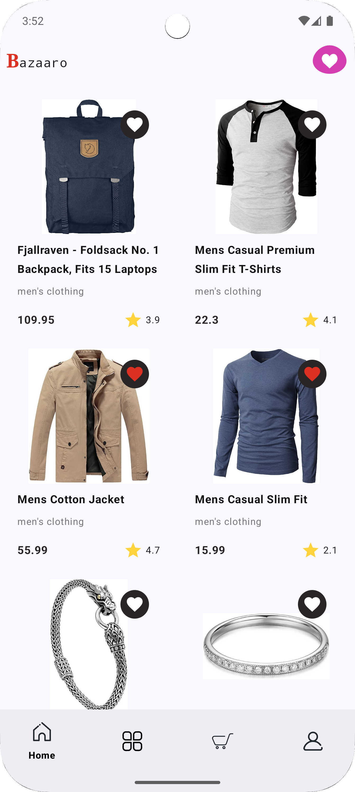
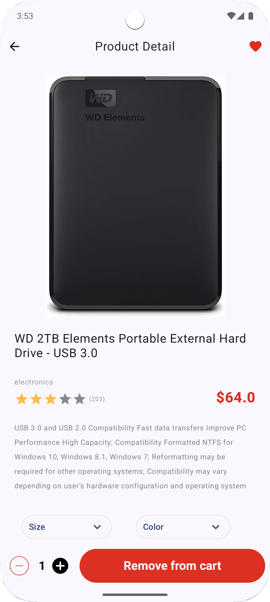
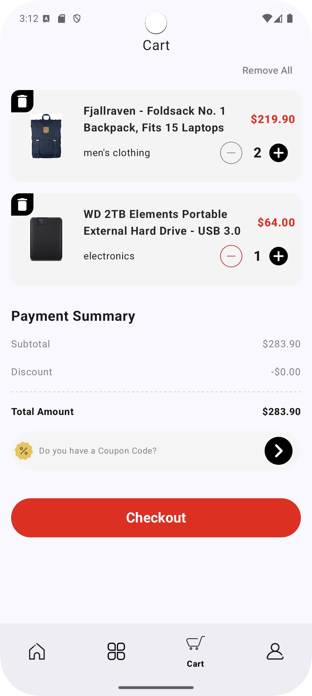

# Bazaaro 🛍️ - E-commerce Android Application

<div align="center">
  
  <br>
  <em>Discover, Shop, and Manage Seamlessly with Jetpack Compose!</em>
</div>

---

Bazaaro is an e-commerce Android application built using modern Android development practices, including Jetpack Compose, Hilt for dependency injection, Retrofit for networking, and Room for local data storage. The app allows users to browse products, add them to their cart, manage favorites, and view product details.

---

## 📸 App Preview  

| Home Screen | Product Details | Cart Management |  
|-------------|-----------------|-----------------|  
|  |  |  |  

---

## 🌟 Key Features  
- **Modern Architecture**: MVVM with Clean Architecture principles  
- **Reactive UI**: Full Jetpack Compose implementation  
- **Data Sync**: Automatic DB ↔ API synchronization  
- **Network Monitoring**: Integrated Chucker debug tool 
- **Smart Product Browsing**: Explore products by category with dynamic filtering  
- **Interactive Cart System**: Real-time quantity adjustment & multi-item management  
- **Favorites Hub**: Save/unsave items with persistent local storage
- **Product Details**: Detailed view of each product, including images, descriptions, and ratings.
- **Intuitive Navigation**: Bottom bar + nested navigation flows  
- **Error Recovery**: Graceful error states with retry capabilities 
- **Lottie Animations**: Smooth loading states and micro-interactions  
- **Multilingual Support**: In-app language change functionality for seamless user experience
- **Per-App Language Preferences**: Android 13 (API 33) support for personalized app language settings

---

## 🛠 Tech Stack  

| Category          | Technologies                                                                                     |
|-------------------|--------------------------------------------------------------------------------------------------|
| **UI**            | Jetpack Compose • Material 3 • Lottie • Coil                                                     |
| **Architecture**  | MVVM • Repository Pattern • State Management w/ Flow & StateFlow                                 |
| **DI**            | Hilt                                                                                            |
| **Networking**    | Retrofit 2 • Moshi • Chucker (Debug) • OkHttp Interceptors                                       |
| **Persistence**   | Room Database                                                                |
| **Async**         | Kotlin Coroutines • Flow                                                                        |

---

## 🗂 Project Structure  

The project is structured into several packages:

- **app**: Contains the main application components, including the `MainActivity`, `App` class, and navigation components.
- **data**: Contains data-related components, including API services, database entities, and repositories.
- **presentation**: Contains UI-related components, including screens, view models, and state management.

---

## 🚀 Getting Started  

To get started with the project, follow these steps:

1. **Clone the repository**:
   ```bash
   git clone https://github.com/Hedayatpour2002/bazaaro.git
   ```

2. **Open the project in Android Studio**:
   - Open Android Studio and select "Open an Existing Project".
   - Navigate to the cloned repository and select the `build.gradle.kts` file.

3. **Build the project**:
   - Sync the project with Gradle files.
   - Build the project to ensure all dependencies are resolved.

4. **Run the app**:
   - Connect an Android device or start an emulator.
   - Click the "Run" button in Android Studio to launch the app.

---

## 🤝 Contributing Guide  

1. Fork the Project  
2. Create your Feature Branch:  
```bash  
git checkout -b feature/amazing-feature  
```  
3. Commit Changes:  
```bash  
git commit -m 'Add some amazing feature'  
```  
4. Push to Branch:  
```bash  
git push origin feature/amazing-feature  
```  
5. Open Pull Request

---

## 📜 License  

This project is licensed under the MIT License. See the [LICENSE](LICENSE) file for details.

---

## 💡 Acknowledgments  
- [Fake Store API](https://fakestoreapi.com/) for mock data  
- Android Developer Community for best practices  
- JetBrains for Kotlin language support  

---

Thank you for checking out Bazaaro! If you have any questions or feedback, feel free to reach out. Happy coding! 🚀
